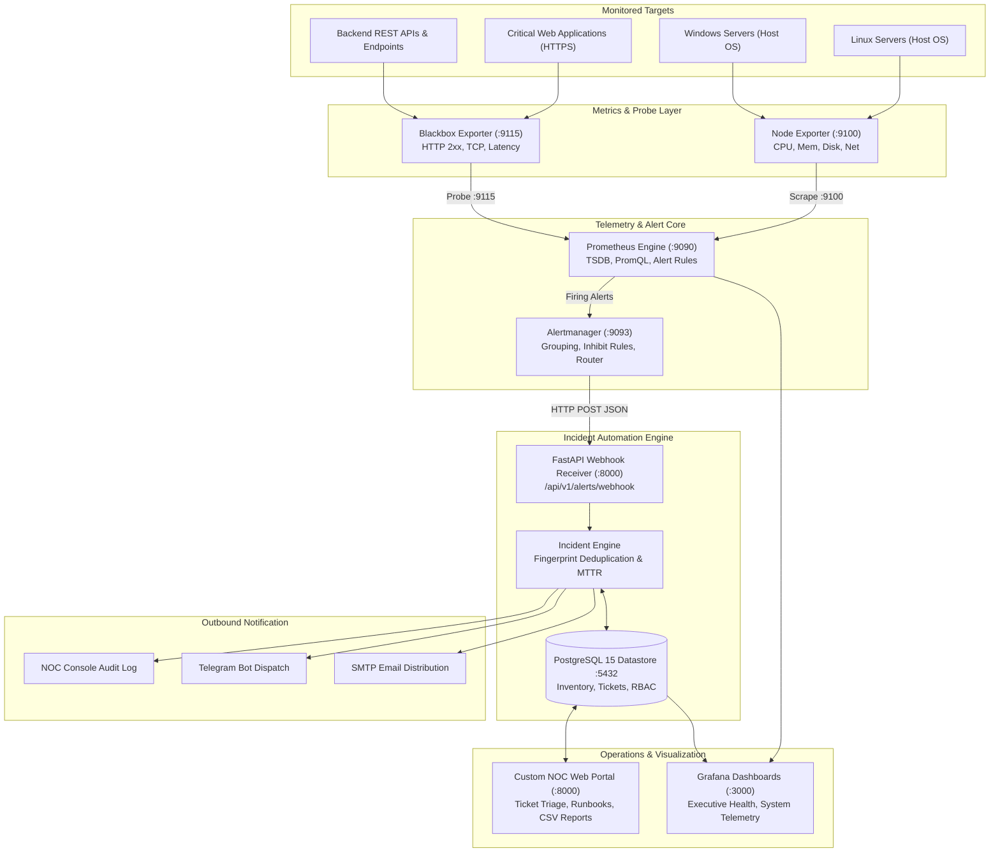

# Enterprise Infrastructure Monitoring & Incident Management Platform


> 📄 **Executive Architecture Specification Document:** [**Download / View ENTERPRISE_SYSTEM_ARCHITECTURE.pdf**](ENTERPRISE_SYSTEM_ARCHITECTURE.pdf) *(Full hybrid cloud topology, CGNAT traversal, 7-stage escalation engine, and live deployment specifications).*

An enterprise-grade, 100% open-source **Infrastructure Observability & ITIL Incident Operations Platform**. Designed for deployment in corporate datacenters, enterprise NOCs, and hybrid cloud environments—delivering the robustness and operational depth of commercial solutions like **BMC TrueSight Operations Management** and **OpsRamp**—this system unifies host telemetry, synthetic endpoint monitoring, noise suppression, automated ITIL incident ticketing, SLA enforcement, and operational runbook execution.


---

## 1. Project Overview

Modern enterprise IT departments require centralized observability across heterogeneous Linux and Windows fleets, VMware vCenter clusters, internal microservices, and customer-facing portals. When infrastructure degrades or outages occur, corporate operations teams must eliminate alert fatigue, correlate root causes, enforce SLAs, and adhere to Standard Operating Procedures (SOPs).

This platform delivers an end-to-end operational monitoring and incident response architecture:
- **Telemetry Collection**: Prometheus scrapes kernel performance metrics via Node Exporter and synthetic probes via Blackbox Exporter.
- **Noise Elimination**: Alertmanager applies grouping and **inhibit (suppression) rules** to prevent cascade alert storms.
- **ITIL Incident Engine**: A Python/FastAPI automation service ingests alert webhooks, deduplicates firing events using cryptographic fingerprints, generates sequential tickets (`INC-2026-XXXX`), and auto-resolves tickets with **Mean Time to Resolution (MTTR)** calculation.
- **Corporate Operations Interfaces**: A responsive dark-mode **NOC Web Portal** and auto-provisioned **Grafana Dashboards**.

---

## 2. Business Problem & Solution

| Enterprise Challenge | Traditional Problem | Our Platform Solution |
|---|---|---|
| **Alert Fatigue & Noise** | A single host outage triggers dozens of cascading alerts (CPU, Memory, Disk, Services). | **Inhibit Rules** automatically suppress downstream performance alerts when a parent node is unreachable. |
| **Transient False Positives** | Brief 5-second CPU spikes wake up on-call engineers. | **Prometheus `for` Hysteresis** requires conditions to persist for 1–5 continuous minutes before firing. |
| **Manual Ticket Overhead** | Engineers spend critical minutes copying alerts into ticketing systems. | **Automated Webhook Ingestion** creates formatted tickets and calculates MTTR upon recovery. |
| **Proprietary Vendor Lock-In** | High licensing fees for BMC TrueSight, OpsRamp, or Datadog. | **100% Open-Source Stack**: Built on Prometheus, Alertmanager, Grafana, PostgreSQL, and FastAPI. |

---

## 3. High-Level System Architecture



---

## 4. Technology Stack

- **Metrics Collection**: Prometheus v2.48.1
- **Hardware & Host Metrics**: Node Exporter v1.7.0 (Linux & Windows metrics)
- **Synthetic HTTP / API Probing**: Blackbox Exporter v0.24.0
- **Alert Dispatcher & Suppression**: Prometheus Alertmanager v0.26.0
- **Automation Backend**: Python 3.10, FastAPI, SQLAlchemy 2.0, Pydantic 2.4
- **Relational Datastore**: PostgreSQL 15 (Alpine)
- **Visualization**: Grafana v10.2.2 & Custom NOC Web Portal (HTML5, Bootstrap 5, Vanilla JS)
- **Orchestration**: Docker & Docker Compose v2

---

## 5. Core Platform Features

- **100% Free & Local Deployment**: Runs completely on Docker Desktop without requiring paid cloud subscriptions.
- **ITIL Priority Matrix (P1–P4)**: Pre-configured threshold rules for CPU, Memory, Disk, Network errors, and Synthetic HTTP checks.
- **Event Deduplication & Noise Suppression**: Alertmanager inhibit rules silence secondary noise when a server is down. Fingerprint hashing ensures only one active ticket exists per issue.
- **Automated Incident Lifecycle**: Tickets auto-create (`OPEN`), update during operator triage (`ACKNOWLEDGED`, `IN_PROGRESS`), and auto-close (`RESOLVED`) when metrics recover.
- **Mean Time to Resolution (MTTR)**: Automatic timestamp delta computation upon resolution stored in PostgreSQL.
- **NOC Operations Web Portal**: Single-page operations portal with login, server inventory, alert feed, triage drawer, and 1-click CSV report export.
- **Auto-Provisioned Grafana**: Executive and technical dashboards boot up pre-connected to Prometheus and PostgreSQL.
- **Safe Failure Simulation**: 5 safe, reversible scripts for CPU, memory, disk, service outages, and webhook testing.
- **Standard Operating Procedures (SOPs)**: 6 comprehensive runbooks in `runbooks/` matching alert annotations.

---

## 6. Monitored Metrics & Thresholds

| Metric Subsystem | PromQL Calculation | Alert Name | Severity | Priority | Threshold Condition |
|---|---|---|---|---|---|
| **Host Availability** | `up == 0` | `HostDown` | Critical | **P1** | Host unreachable for > 1m |
| **Website Uptime** | `probe_success == 0` | `WebsiteDown` | Critical | **P1** | HTTP check fails for > 1m |
| **CPU Saturation** | `100 - (avg(rate(idle[5m])) * 100)` | `HostCpuUtilizationCritical` | Critical | **P1** | CPU > 90% for > 3m |
| **CPU Warning** | `100 - (avg(rate(idle[5m])) * 100)` | `HostCpuUtilizationWarning` | Warning | **P2** | CPU > 80% for > 5m |
| **Memory Exhaustion**| `(1 - (MemAvailable / MemTotal)) * 100` | `HostMemoryUtilizationCritical` | Critical | **P1** | RAM Used > 92% for > 2m |
| **Memory Warning** | `(1 - (MemAvailable / MemTotal)) * 100` | `HostMemoryUtilizationWarning` | Warning | **P2** | RAM Used > 85% for > 3m |
| **Disk Space Full** | `(1 - (Free / Total)) * 100` | `HostDiskUtilizationCritical` | Critical | **P1** | Disk Used > 95% for > 2m |
| **Disk Warning** | `(1 - (Free / Total)) * 100` | `HostDiskUtilizationWarning` | Warning | **P2** | Disk Used > 85% for > 5m |
| **HTTP Latency** | `probe_duration_seconds > 1.5` | `EndpointHighLatency` | Warning | **P3** | Latency > 1.5s for > 2m |
| **Network Errors** | `rate(network_errs[5m]) > 10` | `HostNetworkInterfaceErrors` | Warning | **P3** | Errors > 10/sec for > 2m |

---

## 7. Installation & Quick Start

### Step 1: Clone the Repository
```bash
git clone <repo_url> enterprise-infrastructure-monitoring
cd enterprise-infrastructure-monitoring
```

### Step 2: Configure Environment Variables
```bash
cp .env.example .env
```

### Step 3: Launch Platform via Docker Compose
```bash
docker compose up -d
```

### Step 4: Access User Interfaces

| Component | URL | Default Credentials | Purpose |
|---|---|---|---|
| **Custom NOC Web Portal** | [http://localhost:8090](http://localhost:8090) | `admin` / `AdminPassword123!` | Incident queue, server inventory, triage modal, CSV export |
| **FastAPI Swagger Docs** | [http://localhost:8090/docs](http://localhost:8090/docs) | N/A | Interactive REST API documentation |
| **Grafana Dashboards** | [http://localhost:3000](http://localhost:3000) | `admin` / `admin` | Executive & technical metrics visualizations |
| **Prometheus Web UI** | [http://localhost:9090](http://localhost:9090) | N/A | TSDB queries, target health, rule status |
| **Alertmanager Console** | [http://localhost:9093](http://localhost:9093) | N/A | Active alert grouping, routes, silences |

---

## 8. Safe Failure Simulation & Verification

The platform includes 5 zero-risk, reversible failure simulation scripts in `scripts/`:

```bash
# 1. Simulate High CPU (>80% / >90% load for 30s)
python3 scripts/simulate_high_cpu.py --duration 30

# 2. Simulate Memory Allocation (Allocates 500MB RAM, holds for 20s, cleanly releases)
python3 scripts/simulate_high_memory.py --megabytes 500 --hold_sec 20

# 3. Simulate High Disk Space (Creates temporary file in /tmp, automatically unlinks)
python3 scripts/simulate_disk_alert.py --size_mb 200 --hold_sec 15

# 4. Simulate Website Outage (Hosts mock server on port 8085, shuts down socket listener)
python3 scripts/simulate_service_down.py --port 8085 --up_duration 15

# 5. Simulate Alertmanager Webhook (Instantly injects firing or resolved alerts)
python3 scripts/simulate_webhook_alert.py --alert HostDown --status firing --priority P1
python3 scripts/simulate_webhook_alert.py --alert HostDown --status resolved --priority P1
```

---

## 9. Automated Testing Suite

The project includes an automated test harness covering database DDL, PromQL rules, JWT security, and the incident engine:

```bash
python3 tests/run_tests.py
```

Output:
```text
===========================================================================
 TEST EXECUTION SUMMARY
===========================================================================
 Total Tests Run : 14
 Tests Passed    : 14
 Tests Failed    : 0
 Tests Errored   : 0
 Elapsed Time    : 1.465s
===========================================================================
 [✓] ALL PLATFORM TEST SUITES PASSED SUCCESSFULLY!
```

---

## 10. Operational SOP Runbooks

Every alert rule contains a `runbook_url` pointing directly to an SOP in `runbooks/`:
- [`runbooks/high_cpu_sop.md`](file:///Users/deepak_mamta/.gemini/antigravity/scratch/enterprise-infrastructure-monitoring/runbooks/high_cpu_sop.md): CPU triage, `top`/`ps` commands, runaway kill procedures.
- [`runbooks/high_memory_sop.md`](file:///Users/deepak_mamta/.gemini/antigravity/scratch/enterprise-infrastructure-monitoring/runbooks/high_memory_sop.md): OOM risk, RSS memory inspection, buffer drop, JVM heap leaks.
- [`runbooks/high_disk_sop.md`](file:///Users/deepak_mamta/.gemini/antigravity/scratch/enterprise-infrastructure-monitoring/runbooks/high_disk_sop.md): Filesystem/inode exhaustion, large file identification, safe log truncation.
- [`runbooks/server_down_sop.md`](file:///Users/deepak_mamta/.gemini/antigravity/scratch/enterprise-infrastructure-monitoring/runbooks/server_down_sop.md): P1 server outage protocol, hypervisor console verification, connectivity triage.
- [`runbooks/website_down_sop.md`](file:///Users/deepak_mamta/.gemini/antigravity/scratch/enterprise-infrastructure-monitoring/runbooks/website_down_sop.md): HTTP 5xx/4xx outage triage, SSL cert expiry, reverse proxy restart.
- [`runbooks/slow_website_sop.md`](file:///Users/deepak_mamta/.gemini/antigravity/scratch/enterprise-infrastructure-monitoring/runbooks/slow_website_sop.md): P3 latency degradation, `curl` timing metrics breakdown, database locking analysis.

---

## 11. Enterprise Engineering Documentation Guides
 
- [`docs/ENTERPRISE_PRODUCTION_PLAYBOOK.md`](file:///Users/deepak_mamta/.gemini/antigravity/scratch/enterprise-infrastructure-monitoring/docs/ENTERPRISE_PRODUCTION_PLAYBOOK.md): Corporate production playbook, Windows Active Directory / IIS, VMware ESXi / vCenter, SNMP network monitoring, automated maintenance windows, and backup strategies.
- [`docs/ARCHITECTURE_GUIDE.md`](file:///Users/deepak_mamta/.gemini/antigravity/scratch/enterprise-infrastructure-monitoring/docs/ARCHITECTURE_GUIDE.md): Deep-dive component breakdown and corporate dataflow walkthrough.
- [`docs/INSTALLATION_GUIDE.md`](file:///Users/deepak_mamta/.gemini/antigravity/scratch/enterprise-infrastructure-monitoring/docs/INSTALLATION_GUIDE.md): Step-by-step production installation for Linux, Windows, and macOS.
- [`docs/CONFIGURATION_GUIDE.md`](file:///Users/deepak_mamta/.gemini/antigravity/scratch/enterprise-infrastructure-monitoring/docs/CONFIGURATION_GUIDE.md): Threshold tuning, PromQL reference, and custom alert authoring.
- [`docs/ENTERPRISE_SYSTEM_ARCHITECTURE.md`](file:///Users/deepak_mamta/.gemini/antigravity/scratch/enterprise-infrastructure-monitoring/docs/ENTERPRISE_SYSTEM_ARCHITECTURE.md): Comprehensive hybrid cloud architecture, CGNAT traversal, 7-stage escalation engine, and live deployment specifications.
- [`docs/ENTERPRISE_SYSTEM_ARCHITECTURE.pdf`](file:///Users/deepak_mamta/.gemini/antigravity/scratch/enterprise-infrastructure-monitoring/docs/ENTERPRISE_SYSTEM_ARCHITECTURE.pdf): Publication-grade executive architecture specification document (Formatted PDF).
- [`docs/OPERATIONS_GUIDE.md`](file:///Users/deepak_mamta/.gemini/antigravity/scratch/enterprise-infrastructure-monitoring/docs/OPERATIONS_GUIDE.md): Corporate NOC daily workflow, ticket triage, and SLA targets.
- [`docs/TROUBLESHOOTING_GUIDE.md`](file:///Users/deepak_mamta/.gemini/antigravity/scratch/enterprise-infrastructure-monitoring/docs/TROUBLESHOOTING_GUIDE.md): Common operational failure scenarios and step-by-step fixes.
- [`docs/INTERVIEW_GUIDE.md`](file:///Users/deepak_mamta/.gemini/antigravity/scratch/enterprise-infrastructure-monitoring/docs/INTERVIEW_GUIDE.md): 30 technical deep-dive questions and architectural analyses covering TSDBs, ITIL, Linux, and BMC TrueSight / OpsRamp comparisons.

---

## 12. Live Hybrid Cloud Production Deployment

The platform is actively deployed 24/7 across Oracle Cloud Infrastructure (OCI) Always Free Tier and On-Premises Edge Network:

| Node / Role | Host & Network Address | Services & Responsibilities | Status |
|---|---|---|---|
| **Central Observability Hub (VM 2)** | `deepak-monitoring.duckdns.org`<br/>`80.225.252.145` | • `router-syslog.service` (UDP 514 Syslog & :9125 Exporter)<br/>• `router-watchdog.service` (7-Stage Multi-Target Escalation)<br/>• Prometheus (:9090) & Grafana (:3000)<br/>• Custom NOC Operations Portal (:8090) | **Active (24/7)** |
| **Cloud Drive Server (VM 1)** | `deepak-cloud-drive.duckdns.org`<br/>`161.118.180.68` | • Target 2: Synthetic Blackbox HTTPS Health Probing<br/>• Corporate Cloud Drive & Storage Application | **Active (24/7)** |
| **Secondary Router (Target 1)** | `192.168.1.7`<br/>MAC: `D8:44:89:F5:41:FA` | • Target 1: TP-Link TL-WR845N v4 in AP Mode<br/>• Hardwired to Primary Gateway (ZTE F670LV9) Port 3 (`eth2`)<br/>• Outbound UDP 514 Layer-2 Forwarding State Telemetry | **Active (24/7)** |

For full architectural details, see [ENTERPRISE_SYSTEM_ARCHITECTURE.md](docs/ENTERPRISE_SYSTEM_ARCHITECTURE.md).

---

## 13. Repository Structure

```text
enterprise-infrastructure-monitoring/
├── README.md                              # Master project portfolio documentation
├── router_syslog_exporter.py              # UDP 514 Syslog telemetry daemon & :9125 Prometheus exporter
├── router_watchdog.py                     # 7-stage corporate escalation & multi-target watchdog engine
├── docker-compose.yml                     # 7-container multi-service orchestration
├── .env.example                           # Environment configuration template
├── .gitignore                             # Standard Git exclusions
├── alertmanager/
│   └── alertmanager.yml                   # Grouping, routes, and inhibit (suppression) rules
├── architecture/
│   └── ARCHITECTURE.md                    # System architecture & enterprise comparison
├── backend/
│   ├── Dockerfile                         # Container build definition
│   ├── requirements.txt                   # FastAPI, SQLAlchemy, Pydantic, Uvicorn
│   ├── config.py                          # Application settings loader
│   ├── database.py                        # Resilient PostgreSQL engine & session manager
│   ├── models.py                          # 8 SQLAlchemy ORM database models
│   ├── schemas.py                         # Pydantic request/response validation
│   ├── auth.py                            # PBKDF2 hashing, JWT tokens, RBAC guards
│   ├── main.py                            # FastAPI app, health checks, static mounting
│   ├── routers/                           # Modular API endpoints
│   └── services/                          # Incident engine, notifications, CSV reports
├── database/
│   ├── schema.sql                         # PostgreSQL DDL with indexes & constraints
│   └── init.sql                           # Initialization script with seed accounts & data
├── docs/                                  # Enterprise engineering documentation
│   ├── ENTERPRISE_SYSTEM_ARCHITECTURE.md  # Full live hybrid cloud architecture & CGNAT traversal
│   ├── ARCHITECTURE_GUIDE.md
│   ├── CONFIGURATION_GUIDE.md
│   ├── INSTALLATION_GUIDE.md
│   ├── INTERVIEW_GUIDE.md                 # 30 Technical Interview Q&As
│   ├── OPERATIONS_GUIDE.md
│   ├── RESUME_PROJECT_DESCRIPTION.md      # Resume & LinkedIn portfolio assets
│   └── TROUBLESHOOTING_GUIDE.md
├── frontend/                              # Custom NOC Operations Web Portal
│   ├── index.html                         # Responsive single-page application
│   ├── css/styles.css                     # Dark-mode NOC theme & priority badges
│   └── js/app.js                          # Auth session, API integrations, triage modal
├── grafana/
│   ├── dashboards/                        # 15-panel executive & technical dashboard
│   └── provisioning/                      # Auto-configured datasources & providers
├── prometheus/
│   ├── alert.rules.yml                    # 11 enterprise P1–P4 PromQL alert rules
│   ├── blackbox.yml                       # HTTP 2xx, TCP, ICMP probing modules
│   └── prometheus.yml                     # Scrape jobs & Blackbox relabel configurations
├── runbooks/                              # 6 ITIL SOP Runbooks
├── scripts/                               # 5 Safe, reversible failure simulation scripts
└── tests/                                 # 14 Automated unit and integration tests
```

---

## 14. License

Distributed under the MIT License. Open-source, free for personal and commercial use.

