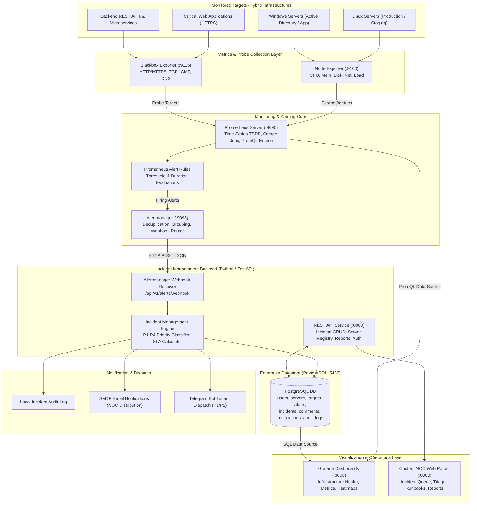

# Architecture Specification & Data Flow

## 1. Executive Summary

The **Enterprise Infrastructure Monitoring & Incident Management Platform** provides automated, real-time observability and ITIL-aligned incident lifecycle handling for on-premises, cloud, and hybrid infrastructure. Designed to emulate enterprise-grade capabilities seen in platforms like **BMC TrueSight Operations Management** and **OpsRamp**, this solution is built entirely on open-source, vendor-neutral technologies: **Prometheus, Alertmanager, Grafana, PostgreSQL, and FastAPI**.

---

## 2. End-to-End Architectural Diagram

---

## 3. Detailed Data Flow Lifecycle

### Step 1: Metric Collection & Active Probing
1. **Host-Level Metrics**: `node_exporter` runs as an agent on Linux and Windows targets (or containerized nodes), exposing kernel and OS-level counters at `/metrics` on port 9100 (CPU counters, memory buffers, filesystem blocks, network interfaces).
2. **Endpoint Health Checks**: `blackbox_exporter` performs active HTTP/HTTPS synthetic probes at regular intervals (15s–60s), validating SSL expiration, HTTP response codes (200 OK), and measuring round-trip latency (HTTP duration in milliseconds).

### Step 2: Ingestion & Threshold Evaluation
1. Prometheus periodically scrapes all configured jobs.
2. The Prometheus evaluation engine continuously runs configured PromQL alert rules (e.g. `node_filesystem_free_bytes / node_filesystem_size_bytes < 0.05` for 5m).
3. If a condition evaluates to true longer than the `for` duration, the state changes from `PENDING` to `FIRING`.

### Step 3: Alert Dispatch & Deduplication
1. Prometheus transmits firing alerts to **Alertmanager**.
2. Alertmanager groups correlated alerts by target and alert name to prevent alert storms.
3. Alertmanager executes routing trees and invokes the FastAPI webhook endpoint:
   `POST /api/v1/alerts/webhook`

### Step 4: Automated Incident Generation & Priority Classification
1. The FastAPI backend receives the structured alert payload.
2. It deduplicates alerts against existing active incidents using the unique Prometheus fingerprint.
3. If no active incident exists for this target and condition, the **Incident Management Engine**:
   - Generates an incident number (e.g., `INC-2026-0042`).
   - Classifies priority (`P1`, `P2`, `P3`, `P4`) based on severity and target criticality.
   - Logs the incident in PostgreSQL with timestamp and initial status `OPEN`.
   - Triggers instant notifications via configured channels (Telegram, Email, Console).
4. If an existing incident is active and the alert resolves (`status: resolved`), the system records the resolution time, computes MTTR (Mean Time to Resolution), and moves the incident to `RESOLVED`.

### Step 5: Operations & Incident Triage (NOC Team)
1. The NOC engineer views live telemetry on **Grafana** (system metrics, server uptime, availability).
2. The NOC engineer manages tickets in the **Custom NOC Web Portal**:
   - Acknowledges incident (`OPEN` → `ACKNOWLEDGED`).
   - Assigns engineer and notes root cause investigation (`IN_PROGRESS`).
   - Follows standardized Runbooks (SOPs) for remediation.
   - Adds resolution notes and closes the ticket (`RESOLVED`).

---

## 4. Comparison: Open-Source Architecture vs Enterprise Platforms

| Architectural Feature | Traditional Enterprise (BMC TrueSight / OpsRamp) | Our Open-Source Platform Implementation |
|---|---|---|
| **Data Collection** | Proprietary Patrol Agents / OpsRamp Gateway Agents | Prometheus Node Exporter & Blackbox Exporter |
| **Event Ingestion & Rules** | TrueSight Cell (BAROC rules) / OpsRamp Policy Engine | Prometheus Alert Rules (PromQL) & Alertmanager |
| **Event Deduplication** | Cell Event Deduplication / OpsRamp Alert Consolidation | Alertmanager `group_by` & Backend Fingerprint Matching |
| **Incident Management** | BMC Remedy / ServiceNow Integration | Dedicated PostgreSQL Relational Incident Engine & REST API |
| **Priority Matrix** | Criticality Matrix (P1-P4) with SLA timers | ITIL P1-P4 Priority Classifier with MTTR tracking |
| **Visualization** | TrueSight Console / OpsRamp Unified Portal | Grafana 10+ & Responsive Custom NOC Operations Portal |
| **Deployment Model** | Complex On-Prem VM Clusters or SaaS Subscription | Self-contained Docker Compose stack (100% Free & Local) |
