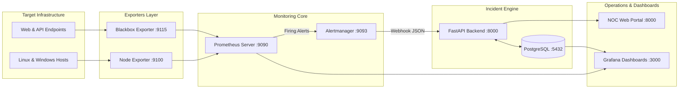

# Enterprise Infrastructure Monitoring Platform: Architecture Guide

## 1. Architectural Philosophy

The **Enterprise Infrastructure Monitoring & Incident Management Platform** was engineered to bring enterprise-level ITIL event and incident orchestration—typically associated with proprietary platforms like **BMC TrueSight Operations Management** and **OpsRamp**—into a vendor-neutral, 100% open-source, cost-free software stack.

The platform prioritizes:
- **Pull-Based Metrics Scalability**: Prometheus pulls metrics using lightweight HTTP endpoints rather than heavy push agents that consume disproportionate client resources.
- **Noise Suppression & Event Deduplication**: Intelligent inhibit rules and fingerprinting prevent alert storms during widespread outages.
- **Stateful ITIL Incident Lifecycle**: Decoupling transient time-series alerts from persistent ITIL tickets with full audit trails, assignment tracking, and SLA/MTTR telemetry.
- **Zero-Friction Local Deployment**: 100% containerized with Docker Compose for local development, testing, and interview demonstrations.

---

## 2. Component Breakdown

### 2.1 Host Exporters (Node Exporter)
- **Role**: Collects kernel counters and OS performance statistics on Linux and Windows targets.
- **Port**: `9100/tcp`
- **Key Metric Subsystems**:
  - `node_cpu_seconds_total`: Core utilization per mode (idle, user, system, iowait).
  - `node_memory_*`: Total physical RAM, available RAM, buffer cache, swap in/out.
  - `node_filesystem_*`: Block capacity, free blocks, and filesystem mount points.
  - `node_network_*`: Interface link status, byte counters, and packet drops/errors.

### 2.2 Synthetic Probing (Blackbox Exporter)
- **Role**: Performs active, non-intrusive synthetic probing of public or private web and network targets.
- **Port**: `9115/tcp`
- **Probing Modules**:
  - `http_2xx`: Sends HTTP/HTTPS GET requests, follows redirects, measures latency, validates 2xx response codes, and verifies TLS certificate validity.
  - `tcp_connect`: Validates port accessibility and socket handshake timing.

### 2.3 Metrics Engine (Prometheus)
- **Role**: Time-series database (TSDB) and rule evaluation engine.
- **Port**: `9090/tcp`
- **Cadence**: Scrapes targets on a 15-second loop; evaluates alerting rules every 15 seconds.
- **Storage**: Local write-ahead log (WAL) and compressed 2-hour blocks retained for 15 days.

### 2.4 Alert Dispatcher (Alertmanager)
- **Role**: Deduplicates, groups, and routes firing alerts.
- **Port**: `9093/tcp`
- **Inhibit Rules**: Suppresses secondary warnings (CPU, RAM, Disk) when parent host or website is down.
- **Routing**: Sends JSON alert batches to the FastAPI backend webhook receiver.

### 2.5 Incident Management Backend (FastAPI)
- **Role**: Core business logic, deduplication, ITIL state machine, and RESTful API.
- **Port**: `8000/tcp`
- **Features**:
  - Webhook listener at `/api/v1/alerts/webhook`.
  - Sequential ticket generator (`INC-2026-XXXX`).
  - Automatic resolution handler calculating exact MTTR.
  - PBKDF2 password hashing and JWT token issuance.
  - Multi-channel notification dispatchers (local audit log, Telegram, SMTP).

### 2.6 Persistence Layer (PostgreSQL)
- **Role**: Relational store for users, inventory, probe targets, alerts, incidents, comments, and audit logs.
- **Port**: `5432/tcp`

### 2.7 Visualization Layer (Grafana & Custom NOC Portal)
- **Grafana (Port 3000)**: Auto-provisioned executive KPI cards, PromQL performance graphs, and live alert grids.
- **Custom NOC Portal (Port 8000)**: Clean, single-page application for ticket triage, engineer collaboration notes, root-cause entry, and CSV exports.
