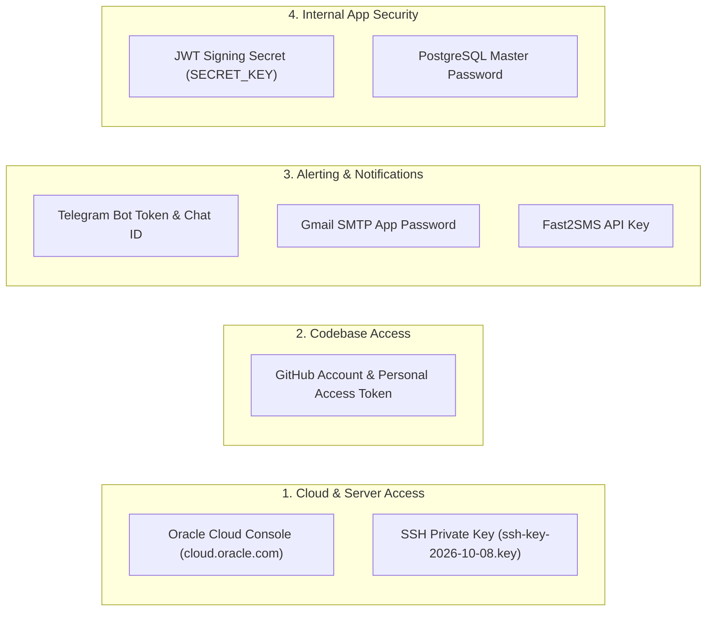

# Enterprise Infrastructure Monitoring & Incident Operations Platform
## Credentials, Secrets & Administrative Access Recovery Guide


---

## 1. Overview & Golden Security Rule

**Golden Rule:** Never commit passwords, private SSH keys, Telegram bot tokens, database secrets, or API keys to any Git repository (public or private).

This guide documents how to securely archive, preserve, and regenerate all access credentials required to operate the platform if your local computer is lost, formatted, or destroyed.

---

## 2. Infrastructure Credentials Inventory

The platform relies on 6 distinct administrative access credentials:



---

## 3. How to Recover Each Credential Layer

### 3.1 Oracle Cloud Infrastructure (OCI) & Server SSH Keys
* **Account Login**: [https://cloud.oracle.com](https://cloud.oracle.com)
  * Account Email: `infoworld2112@gmail.com`
  * Tenancy Name: Check your original OCI welcome email if forgotten.
* **Recovering Lost SSH Private Key**:
  * If your local `ssh-key-2026-10-08.key` is permanently lost:
    1. Log in to the OCI Web Console.
    2. Navigate to **Compute** $\rightarrow$ **Instances** $\rightarrow$ Select your instance (`VM 2` or `VM 1`).
    3. Under **Resources**, click **Console Connection** $\rightarrow$ **Launch Cloud Shell Connection** (or **Reboot in Maintenance Mode**).
    4. From the OCI Cloud Shell, append your new public key into `/home/ubuntu/.ssh/authorized_keys`.
    5. You can now reconnect using your new private key.

### 3.2 GitHub Account & Repository Access
* **Account**: [https://github.com/erdipu](https://github.com/erdipu)
* **Email**: `infoworld2112@gmail.com`
* **Recovery Codes**: Always save your GitHub 2FA recovery codes in a secure offline location (printed on paper or stored in an encrypted password manager).
* **Generating a New Personal Access Token**:
  1. Go to **Settings** $\rightarrow$ **Developer settings** $\rightarrow$ **Personal access tokens** $\rightarrow$ **Tokens (classic)**.
  2. Click **Generate new token**.
  3. Scope: Check `repo` (Full control of private repositories) and `workflow`.
  4. Copy the token and save it into your password manager.

### 3.3 Telegram Alert Bot Token & Chat ID
* **Bot Username**: `@my_infrastructure_alert_bot`
* **Current Chat ID**: `952086426`
* **Regenerating a Lost Bot Token**:
  1. Open Telegram on your phone or desktop.
  2. Search for the official bot: `@BotFather`.
  3. Send command: `/mybots`.
  4. Select `@my_infrastructure_alert_bot`.
  5. Click **API Token** $\rightarrow$ **Revoke current token** (or copy existing token).
  6. Place the token into `/home/ubuntu/alert_config.json` on VM 2:
     ```json
     {
       "telegram_bot_token": "<YOUR_NEW_TOKEN>",
       "telegram_chat_id": "952086426"
     }
     ```
  7. Restart the service: `sudo systemctl restart router-watchdog`.

### 3.4 Gmail SMTP App Password (Outbound Alerts)
* **Sender / Recipient Email**: `infoworld2112@gmail.com`
* **Server**: `smtp.gmail.com`, Port: `587` (STARTTLS)
* **Regenerating an App Password**:
  1. Go to [Google Account Security](https://myaccount.google.com/security).
  2. Ensure **2-Step Verification** is turned ON.
  3. In the search box at the top, type **App passwords**.
  4. App Name: Enter `Infrastructure Monitoring`.
  5. Click **Create**. Google will display a 16-character password (e.g. `abcd efgh ijkl mnop`).
  6. Copy this password into `.env` as `SMTP_PASSWORD` and in `router_watchdog.py`.

### 3.5 Fast2SMS Bulk Gateway API Key
* **Website**: [https://www.fast2sms.com](https://www.fast2sms.com)
* **Recovery**:
  1. Log in to your Fast2SMS account.
  2. Navigate to **Dev API**.
  3. Copy your authorization token.
  4. Update `fast2sms_api_key` in `/home/ubuntu/alert_config.json`.

### 3.6 Application Secret Keys (JWT & Database)
* **Database Password**: Set in `.env` as `POSTGRES_PASSWORD`.
* **JWT Secret Key**: Used to cryptographically sign session tokens for the NOC Portal.
* **Generate a Cryptographically Secure Key**:
  ```bash
  python3 -c "import secrets; print(secrets.token_urlsafe(32))"
  ```
  Place this into `.env` as `SECRET_KEY`.

---

## 4. Secure Offline Credential Storage (Zero-Cost Recommendation)

To ensure you never lose access even during a catastrophic PC failure:

### Method A: Free Password Manager (Recommended)
1. Install **Bitwarden** (100% Free, end-to-end encrypted, zero-knowledge).
2. Create an entry titled `Enterprise Monitoring Infrastructure`.
3. Store:
   * GitHub PAT and recovery codes.
   * Oracle Cloud login credentials.
   * Telegram Bot Token and Chat ID.
   * Gmail SMTP App Password.
   * Private SSH Key (`ssh-key-2026-10-08.key` attached as a secure file).
4. Access your vault from any mobile phone or browser anytime.

### Method B: Encrypted Physical USB Backup
1. Copy all credentials into a directory:
   ```bash
   mkdir -p ~/safe_secrets
   cp ~/.ssh/oracle_monitoring.key ~/safe_secrets/
   cp /home/ubuntu/alert_config.json ~/safe_secrets/
   cp .env ~/safe_secrets/
   ```
2. Encrypt using GPG or OpenSSL:
   ```bash
   tar -czf - ~/safe_secrets | openssl enc -aes-256-cbc -pbkdf2 -iter 100000 -out ~/secrets_backup.enc
   ```
3. Copy `secrets_backup.enc` to an external USB flash drive and store it in a physical safe or secure desk drawer.
