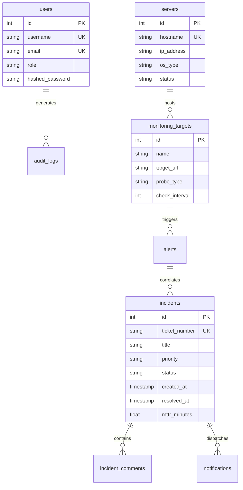

# Enterprise Infrastructure Monitoring & Incident Operations Platform
## Database Backup, Restoration & Data Integrity Guide

-336791)


---

## 1. Database Architecture & Schemas

The platform datastore (`monitoring_db`) runs on PostgreSQL 15 within container `eim-postgres` (or as a native service on port 5432). It persists all ITIL operations records across 8 relational tables:



---

## 2. Automated Nightly Backup Setup (Cron Job)

To ensure zero data loss without manual intervention, configure a recurring Linux `cron` job on Oracle Cloud VM 2:

### 2.1 Install Cron Schedule
```bash
# Open crontab editor on VM 2
crontab -e
```

### 2.2 Add Nightly 2:00 AM IST Backup Schedule
```cron
# Run PostgreSQL automated snapshot every night at 2:00 AM IST (20:30 UTC)
30 20 * * * /bin/bash /home/ubuntu/enterprise-infrastructure-monitoring/scripts/backup_database.sh >> /var/log/eim_backup.log 2>&1
```

---

## 3. Restoring the Database (Step-by-Step)

### 3.1 Interactive Safe Restoration
The platform provides a hardened restoration script that automatically:
1. Validates GZIP integrity.
2. Captures a safety backup of the existing state.
3. Terminates active client connections gracefully.
4. Restores records from the compressed SQL archive.
5. Verifies post-restore table counts.

Execute on Oracle Cloud VM 2 (or local machine):
```bash
cd enterprise-infrastructure-monitoring
bash scripts/restore_database.sh backups/eim_db_backup_20261010_120706.sql.gz
```

*Sample Interactive Output:*
```text
[*] Verifying gzip archive integrity of backups/eim_db_backup_20261010_120706.sql.gz...
[+] Archive integrity verified successfully.
====================================================================
 WARNING: This will overwrite data in database 'monitoring_db'!
 Target Backup: backups/eim_db_backup_20261010_120706.sql.gz
====================================================================
Are you absolutely sure you want to proceed? (yes/no): yes
[*] Creating safety snapshot of existing database state to ./backups/safety_snapshots/pre_restore_safety_20261010_123000.sql.gz...
[+] Safety snapshot created.
[*] Terminating active connections to 'monitoring_db'...
[*] Restoring database via Docker container (eim-postgres)...
[+] Verification successful! Restored 8 active tables into 'monitoring_db':
 alerts
 audit_logs
 incident_comments
 incidents
 monitoring_targets
 notifications
 servers
 users

====================================================================
 [SUCCESS] Database restoration completed successfully!
====================================================================
```

### 3.2 Non-Interactive / Scripted Restoration
For automated disaster recovery scripts or CI pipelines, pass `--force`:
```bash
bash scripts/restore_database.sh backups/eim_db_backup_20261010_120706.sql.gz --force
```

---

## 4. Post-Restoration Verification & Health Queries

After restoring, verify data integrity by running these SQL diagnostics:

```bash
# Connect to container database
docker exec -it eim-postgres psql -U postgres -d monitoring_db
```

```sql
-- 1. Check table record counts
SELECT 'users' AS tbl, count(*) FROM users
UNION ALL
SELECT 'servers', count(*) FROM servers
UNION ALL
SELECT 'monitoring_targets', count(*) FROM monitoring_targets
UNION ALL
SELECT 'incidents', count(*) FROM incidents
UNION ALL
SELECT 'alerts', count(*) FROM alerts;

-- 2. Verify recent incident resolution MTTR
SELECT ticket_number, priority, status, mttr_minutes, created_at 
FROM incidents 
ORDER BY created_at DESC 
LIMIT 5;

-- 3. Verify admin account exists
SELECT id, username, email, role, is_active FROM users WHERE username = 'admin';
```

---

## 5. Corrupted Database Recovery (Disaster Scenario)

If the database container fails to start due to corrupted data pages:

```bash
# 1. Stop the failing container
docker compose stop postgres

# 2. Re-create the PostgreSQL volume from scratch
docker compose rm -f postgres
docker volume rm enterprise-infrastructure-monitoring_postgres_data || true

# 3. Boot fresh database instance
docker compose up -d postgres

# 4. Wait for database readiness (5 seconds)
sleep 5

# 5. Restore from latest verified snapshot
LATEST=$(ls -t backups/eim_db_backup_*.sql.gz | head -n 1)
bash scripts/restore_database.sh "${LATEST}" --force

# 6. Restart backend application
docker compose restart backend
```
Full database recreation and restoration completes in under **60 seconds**.
