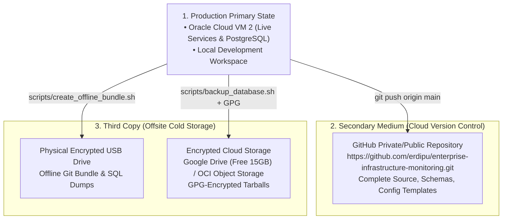

# Enterprise Infrastructure Monitoring & Incident Operations Platform
## Master Disaster Recovery Plan (DRP)


---

## 1. Executive Summary & Purpose

The **Enterprise Infrastructure Monitoring & Incident Operations Platform** oversees multi-target infrastructure:
* **Target 1**: On-Premises Secondary Router (TP-Link TL-WR845N v4 in AP Mode, `192.168.1.7`, MAC: `D8:44:89:F5:41:FA`).
* **Target 2**: Corporate Cloud Drive Server (Oracle Cloud VM 1, `161.118.180.68`, `https://deepak-cloud-drive.duckdns.org`).
* **Central Hub**: Oracle Cloud VM 2 (`80.225.252.145`, `deepak-monitoring.duckdns.org`).

This **Master Disaster Recovery Plan** establishes the operational procedures to recover the entire platform from zero in the event of:
1. Complete local PC hardware failure, formatting, theft, or fire.
2. Loss or deletion of the active AI coding conversation / IDE workspace.
3. Total destruction or accidental deletion of cloud virtual machines.
4. Database corruption, table drops, or storage loss.
5. GitHub repository outage or account credential lockout.

---

## 2. Recovery Objectives (RTO & RPO)

| Metric | Target Objective | Definition | Technical Guarantee |
|---|---|---|---|
| **RTO (Recovery Time Objective)** | **&lt; 15 Minutes** | Maximum allowable downtime before monitoring and incident alerts are fully restored. | Pre-built Docker Compose orchestration, systemd service templates, and automated restore scripts. |
| **RPO (Recovery Point Objective)** | **&lt; 24 Hours** | Maximum allowable data loss measured in time. | Nightly automated PostgreSQL database dumps (`pg_dump`) and persistent git history. |

---

## 3. The 3-2-1 Zero-Cost Backup Strategy

The platform adheres to the industry gold-standard **3-2-1 Backup Rule** without incurring any paid cloud subscription costs:



1. **3 Copies of Data**:
   * **Copy 1**: Live Production State on Oracle Cloud VM 2 and local computer.
   * **Copy 2**: Cloud Version Control on GitHub.
   * **Copy 3**: Cold offline archive on an encrypted external USB drive or Google Drive (free 15 GB).
2. **2 Different Storage Media Types**:
   * Git version-controlled source repository (GitHub cloud).
   * Compressed filesystem archives (`.tar.gz` and `.sql.gz`).
3. **1 Copy Stored Off-Site**:
   * Stored outside your physical home/office (GitHub + OCI / Google Drive).

---

## 4. Disaster Failure Scenarios & Step-by-Step Recovery

### Scenario 1: Local PC Formatted, Stolen, or Damaged in Natural Disaster
* **Impact**: Local source code, IDE configurations, and SSH private keys on your workstation are lost.
* **Production Status**: Production monitoring on Oracle Cloud VM 2 continues running uninterrupted 24/7.
* **Recovery Procedure**:
  1. Acquire new/formatted PC (Mac, Windows, or Linux).
  2. Install Git, Python 3.10+, and Docker Desktop.
  3. Clone the repository:
     ```bash
     git clone https://github.com/erdipu/enterprise-infrastructure-monitoring.git
     cd enterprise-infrastructure-monitoring
     ```
  4. Restore your SSH private key (`ssh-key-2026-10-08.key`) from your secure offline backup or password manager.
  5. Follow the [`PC_REBUILD_GUIDE.md`](PC_REBUILD_GUIDE.md) to re-establish complete operational control.

### Scenario 2: Current AI Coding Assistant Conversation Deleted or Expired
* **Impact**: Chat history, context memory, and prompts in the AI assistant interface are gone.
* **Protection Mechanism**: All project architecture, scripts, database schemas, and guides are fully committed to Git. **Zero knowledge resides solely in the AI chat window**.
* **Recovery Procedure**:
  1. Open a new chat session with your AI assistant.
  2. Provide the repository link: `https://github.com/erdipu/enterprise-infrastructure-monitoring`.
  3. Reference [`docs/ENTERPRISE_SYSTEM_ARCHITECTURE.md`](ENTERPRISE_SYSTEM_ARCHITECTURE.md) and [`README.md`](../README.md).
  4. The AI assistant can immediately read the full project context from the repository files.

### Scenario 3: Complete Loss or Reinstallation of Oracle Cloud VM 2
* **Impact**: VM 2 (`80.225.252.145`) is destroyed or accidentally terminated in the OCI Console.
* **Recovery Procedure**:
  1. Log in to the [Oracle Cloud Console](https://cloud.oracle.com).
  2. Provision a new Always Free Ubuntu 22.04 LTS instance (e.g. `VM.Standard.E2.1.Micro` or Ampere A1).
  3. In OCI Virtual Cloud Network (VCN) Ingress Rules, allow:
     * TCP: 22 (SSH), 8090 (NOC Portal), 3000 (Grafana), 9090 (Prometheus), 9093 (Alertmanager), 9125 (Exporter).
     * UDP: 514 (Syslog).
  4. SSH into the new instance:
     ```bash
     ssh -i "path/to/key.key" ubuntu@<NEW_INSTANCE_IP>
     ```
  5. Follow [`docs/PROJECT_SETUP_GUIDE.md`](PROJECT_SETUP_GUIDE.md) to install Docker, clone the repo, restore the database snapshot, and launch systemd services.
  6. In DuckDNS, update `deepak-monitoring.duckdns.org` to point to `<NEW_INSTANCE_IP>`.
  7. In the ZTE gateway (`http://192.168.1.1`), update the syslog server IP if the public IP changed.

### Scenario 4: Database Corruption or Accidental Table Deletion
* **Impact**: PostgreSQL `monitoring_db` tables are dropped or corrupted.
* **Recovery Procedure**:
  1. SSH to VM 2.
  2. Run the verified automated restoration script:
     ```bash
     cd /home/ubuntu/enterprise-infrastructure-monitoring
     bash scripts/restore_database.sh backups/eim_db_backup_<LATEST>.sql.gz
     ```
  3. The script automatically creates a pre-restore safety snapshot, drops/recreates schema, restores records, and verifies table counts.
  4. Full recovery takes less than **30 seconds**.

### Scenario 5: Secondary Router (TP-Link TL-WR845N) Hardware Failure
* **Impact**: The physical secondary router hardware fails or is replaced with a new unit.
* **Recovery Procedure**:
  1. Connect the new router to physical **Port 3** of the primary ZTE gateway.
  2. Log into the new router web interface, set its static IP to `192.168.1.7` (or keep in AP mode).
  3. Note the new MAC address (e.g. `AA:BB:CC:DD:EE:FF`).
  4. In `router_syslog_exporter.py` on VM 2, update `TPLINK_MAC = "aa:bb:cc:dd:ee:ff"`.
  5. Restart the service:
     ```bash
     sudo systemctl restart router-syslog
     ```
  6. The watchdog immediately resumes monitoring without interrupting VM 1 probing.

---

## 5. Emergency Recovery Command Matrix

| Task | Execution Host | Exact Command |
|---|---|---|
| **Create Manual DB Backup** | VM 2 | `bash scripts/backup_database.sh` |
| **Restore Database Snapshot** | VM 2 | `bash scripts/restore_database.sh <backup_file.sql.gz>` |
| **Verify Backup Integrity** | Local PC / VM 2 | `python3 scripts/verify_backup_integrity.py <backup_file.sql.gz>` |
| **Create Offline Git Bundle** | Local PC / VM 2 | `bash scripts/create_offline_bundle.sh` |
| **Restart Watchdog Engine** | VM 2 | `sudo systemctl restart router-watchdog` |
| **Restart Telemetry Exporter** | VM 2 | `sudo systemctl restart router-syslog` |
| **Restart All Containers** | VM 2 | `docker compose down && docker compose up -d` |
| **Check Active Systemd Logs** | VM 2 | `sudo journalctl -u router-watchdog -f --no-pager` |

---

## 6. Disaster Recovery Verification Schedule

To guarantee that backups are not just stored but **100% restorable**, perform this quarterly DR drill:

1. **Every Month**: Run `scripts/verify_backup_integrity.py` on the latest automated SQL backup.
2. **Every 3 Months**: Execute `scripts/create_offline_bundle.sh` and transfer the `.bundle` and `.tar.gz` to your external backup storage.
3. **Every 6 Months**: Test restoring a database snapshot into a clean local Docker PostgreSQL container and verify that all 8 tables and alert history load without errors.
