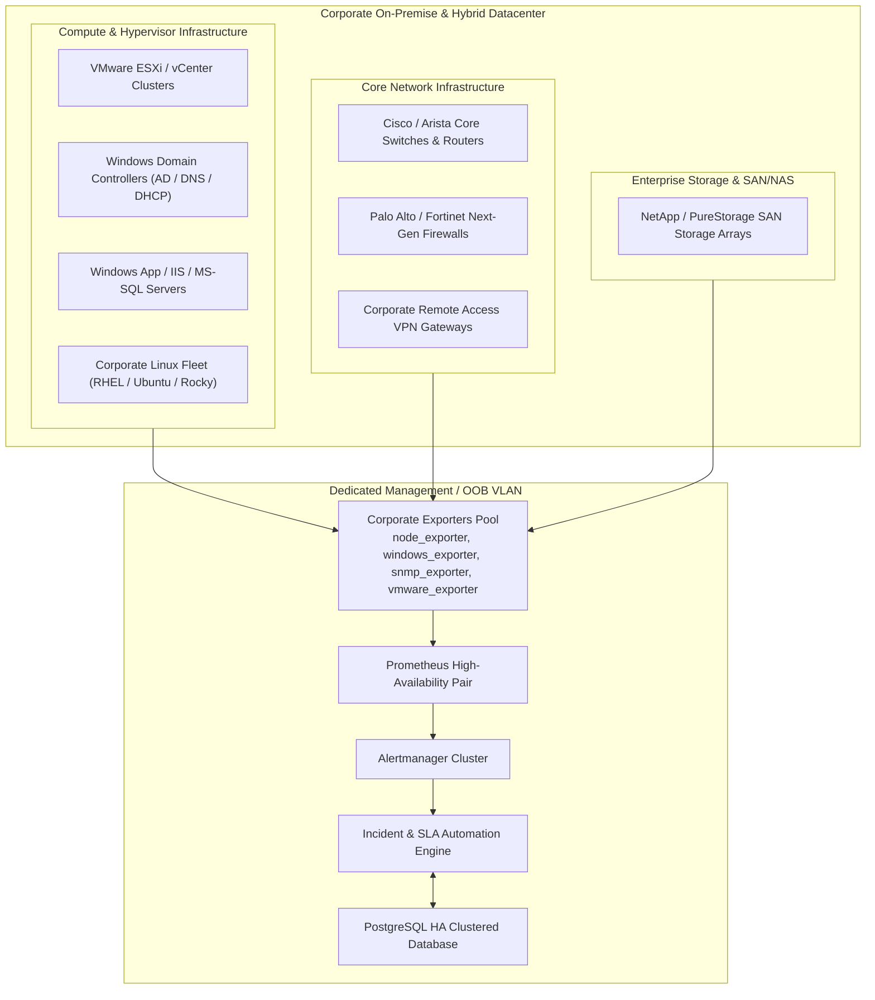

# Enterprise Corporate Production Playbook & Hardening Guide

## 1. Corporate Deployment Architecture Overview

In a real enterprise environment (Financial, Telecom, Healthcare, or Corporate IT), monitoring spans across heterogeneous datacenters, virtualization clusters (VMware vCenter/ESXi), physical rack servers, Windows Active Directory domains, and multi-tier enterprise applications.



---

## 2. Monitoring Real Corporate Infrastructure Targets

### 2.1 Monitoring Windows Server (Active Directory, IIS, MS-SQL)
In corporate Windows environments, install **`windows_exporter`** (formerly `wmi_exporter`) as a Windows Service via MSI or Group Policy (GPO):

```powershell
# Silent installation via GPO or PowerShell
msiexec /i windows_exporter-0.24.0-amd64.msi ENABLED_COLLECTORS="cpu,cs,logical_disk,net,os,service,system,ad,iis,mssql" LISTEN_PORT=9182 /qn
```

#### Windows Prometheus Scrape Job (`prometheus/prometheus.yml`):
```yaml
- job_name: 'corporate_windows_fleet'
  scrape_interval: 15s
  static_configs:
    - targets:
        - '10.20.10.11:9182' # srv-dc01.corp.internal (Domain Controller)
        - '10.20.10.12:9182' # srv-dc02.corp.internal (Backup DC)
        - '10.20.20.50:9182' # srv-sql01.corp.internal (SQL Cluster)
        - '10.20.30.25:9182' # srv-iis01.corp.internal (Corporate Intranet)
      labels:
        os_type: 'windows'
        domain: 'corp.internal'
        tier: 'core-directory'
```

#### Dedicated Windows Alert Rules:
- **Active Directory Replication Failure**:
  ```promql
  windows_ad_replication_status == 0
  ```
- **Windows Service Unexpected Stop** (e.g., DNS, W32Time, NTDS):
  ```promql
  windows_service_status{name=~"NTDS|DNS|W32Time", status="running"} == 0
  ```

---

### 2.2 Monitoring VMware ESXi & vCenter Clusters
In enterprise datacenters running VMware vCenter, metrics from hypervisors, datastores, and VM guests are extracted using `vmware_exporter`:

```yaml
- job_name: 'vmware_vcenter'
  metrics_path: /metrics
  params:
    section: [vcenter]
  static_configs:
    - targets: ['vcenter.corp.internal']
  relabel_configs:
    - target_label: __address__
      replacement: 'vmware-exporter:9272'
```

#### VMware Enterprise Alerts:
- **ESXi Host Disconnected from vCenter (P1)**:
  ```promql
  vmware_host_connection_state{state="connected"} == 0
  ```
- **Datastore Storage Exhaustion > 90% (P1)**:
  ```promql
  (1 - (vmware_datastore_free_size_bytes / vmware_datastore_capacity_bytes)) * 100 > 90
  ```

---

### 2.3 Monitoring Core Network Devices (Switches, Routers, Firewalls via SNMP)
Corporate network gear does not run HTTP agents; they expose metrics via **SNMP v2c/v3**. Deploy `snmp_exporter`:

```yaml
- job_name: 'corporate_network_switches'
  static_configs:
    - targets:
        - '10.254.1.1' # core-switch-01.corp
        - '10.254.1.2' # core-switch-02.corp
        - '10.254.2.1' # edge-firewall-01.corp
  metrics_path: /snmp
  params:
    module: [if_mib]
  relabel_configs:
    - source_labels: [__address__]
      target_label: __param_target
    - target_label: __address__
      replacement: 'snmp-exporter:9116'
```

---

## 3. Corporate Maintenance Windows & Patching Cycles

During planned maintenance (e.g., Monthly Microsoft Patch Tuesday, Linux kernel updates, database migrations), servers will reboot or stop services. In a corporate NOC, triggering false-positive P1 incidents during maintenance is strictly prohibited.

### 3.1 Creating Maintenance Silences via Alertmanager API
Use our automated script [`scripts/maintenance_window.py`](file:///Users/deepak_mamta/.gemini/antigravity/scratch/enterprise-infrastructure-monitoring/scripts/maintenance_window.py) to suppress alerts during approved change windows:

```bash
# Silence alerts for host srv-linux-prod-01 for 2 hours during scheduled patching (CHG-2026-8812)
python3 scripts/maintenance_window.py \
  --instance srv-linux-prod-01 \
  --duration_hours 2 \
  --comment "Scheduled kernel patching per approved Change Request CHG-2026-8812" \
  --author "Deepak (SysAdmin)"
```

Alertmanager suppresses notifications while metrics continue collecting, ensuring gap-free historical records without false tickets.

---

## 4. Production Database Backup & Retention

Corporate compliance mandates regular database snapshots for disaster recovery.

### 4.1 Automated Backup Script (`scripts/backup_database.sh`)
```bash
chmod +x scripts/backup_database.sh
./scripts/backup_database.sh
```
- Dumps PostgreSQL schema, server inventory, and historical incident audit logs.
- Compresses snapshots using gzip.
- Enforces corporate 30-day snapshot retention.

---

## 5. Security & Corporate Access Control

### 5.1 Corporate Reverse Proxy with SSL/TLS (Nginx)
In production, place the platform behind an Nginx reverse proxy with corporate TLS certificates:
- HTTPS on port 443 with HSTS enabled.
- Rate limiting on `/api/v1/auth/login`.
- Security headers: `X-Frame-Options DENY`, `X-Content-Type-Options nosniff`, `Strict-Transport-Security`.

### 5.2 Active Directory / LDAP Integration Readiness
The user management layer can be tied directly to Corporate Active Directory via LDAP/SAML. The current RBAC model (`admin`, `operator`, `viewer`) aligns directly with corporate security groups:
- `CN=NOC-Admins,OU=Groups,DC=corp,DC=internal` → `admin`
- `CN=NOC-Operators,OU=Groups,DC=corp,DC=internal` → `operator`
- `CN=Corporate-Stakeholders,OU=Groups,DC=corp,DC=internal` → `viewer`
