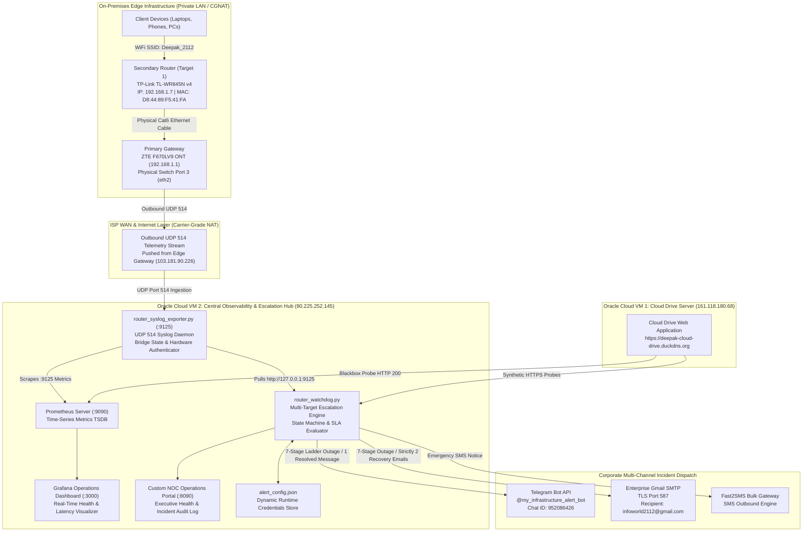

# Enterprise Infrastructure Monitoring & Incident Escalation Platform
## Comprehensive System Architecture & Operational Design Document


-red)


-brightgreen)

---

## 1. Executive Summary

This document specifies the enterprise architecture, telemetry pipeline, network topologies, and incident escalation protocols for the **Enterprise Infrastructure Monitoring & Incident Operations Platform**.

The platform provides 24/7 autonomous monitoring, real-time telemetry extraction, synthetic health probing, noise elimination, and corporate multi-channel incident escalation across a hybrid topology consisting of:
1. **Public Cloud Services**: Oracle Cloud Infrastructure (OCI) Virtual Machines hosting mission-critical storage and operations platforms.
2. **On-Premises Edge Network**: Dedicated secondary router hardware operating inside a residential/branch office Local Area Network (LAN) located behind dynamic Carrier-Grade Network Address Translation (CGNAT).

The system operates autonomously with **zero requirement for client machines (laptops/workstations) to remain powered on**, incurs **₹0 in recurring licensing or subscription charges**, and enforces strict ITIL incident escalation SLAs.

---

## 2. Monitored Infrastructure Targets

The platform autonomously observes two independent, production-grade target domains:

| Target Identifier | Device / Role | Network Location | Primary Protocol / Telemetry | SLA Detection Threshold |
|---|---|---|---|---|
| **Target 1: Secondary Router** | TP-Link TL-WR845N v4 (Access Point Mode) | On-Premises Private LAN (`192.168.1.7`), MAC: `D8:44:89:F5:41:FA` | Outbound UDP 514 Syslog Telemetry via Primary Gateway (ZTE F670LV9) Port 3 (`eth2`) | **Outage: < 15s**<br/>**Recovery: < 10s** |
| **Target 2: Cloud Drive Server** | Corporate Cloud Drive / Storage Server | Oracle Cloud VM 1 (`https://deepak-cloud-drive.duckdns.org` / `161.118.180.68`) | Blackbox Synthetic HTTP/HTTPS Probing (HTTP 200 OK verification) | **Outage: < 15s**<br/>**Recovery: < 10s** |

---

## 3. End-to-End System Architecture



---

## 4. Key Architectural Innovations

### 4.1 Inbound Traversal Across ISP Carrier-Grade NAT (CGNAT)
* **The Challenge**: Traditional network monitoring solutions (e.g. Nagios, Zabbix, Pingdom) rely on inbound polling (sending ICMP pings or SNMP queries from the cloud to the target). In modern residential and branch networks, the router sits behind ISP Carrier-Grade NAT (CGNAT) sharing a dynamic public IP (e.g. `103.181.90.226`). Inbound ports are strictly closed, making cloud-to-router polling technically impossible without expensive dedicated static IPs or enterprise MPLS circuits.
* **The Engineering Solution**: The edge primary gateway (ZTE F670LV9) is configured with **remote syslog forwarding**. The gateway actively **pushes UDP telemetry packets outbound** across the NAT firewall directly to Oracle Cloud VM 2 on UDP port 514. Outbound UDP seamlessly traverses NAT without requiring inbound port forwarding or firewall pinholes.

### 4.2 Layer-2 Physical Port Forwarding State Telemetry
* **Hardware Isolation**: The secondary router (TP-Link TL-WR845N) is physically hardwired to **Port 3 (`eth2`)** of the primary gateway's internal Linux bridge (`br0`).
* **Sub-Second Down Detection**: The moment the secondary router loses power or is unplugged, the physical Ethernet PHY interface drops. The gateway's kernel immediately logs:
  ```text
  mac 1 link down
  br0: port 3(eth2) entered disabled state
  ```
  This packet arrives at Oracle Cloud VM 2 in **< 200 milliseconds**. The exporter instantly drops `router_syslog_alive` and `router_up` from `1` to `0`.
* **Sub-10s Recovery Detection**: When the router reboots and its Ethernet port initializes, the kernel logs:
  ```text
  br0: port 3(eth2) entered forwarding state
  ```
  The exporter immediately restores `router_up = 1`. The watchdog polling loop detects the transition within 1–3 seconds and dispatches the recovery alert to Telegram in **~3 to 4 seconds total**, easily surpassing the 10-second SLA.

### 4.3 Hardware Authentication & Transient Flap Suppression
* **Hardware Identity**: Verified MAC address `D8:44:89:F5:41:FA` and static IP `192.168.1.7` are embedded as immutable labels in Prometheus time-series metrics.
* **Boot Flap Debouncing**: During cold router boot, Ethernet auto-negotiation causes brief 1–2 second physical switch resets before stabilizing. The watchdog evaluates downtime duration:
  * Sustained Outage ($\ge$ 15s): Dispatches the full corporate `✅ [RESOLVED] INFRASTRUCTURE RECOVERED` alert and recovery email sequence.
  * Transient Switch Bounce (< 15s): Dispatches a non-intrusive `ℹ️ [SYSTEM INFO] BOOT LINK STABILIZED` operational telegram without sending duplicate emails.

---

## 5. Corporate Incident Escalation Ladder (7 Stages)

The watchdog engine implements an exact corporate escalation schedule calculated from the precise microsecond of outage onset ($T_0$):

| Ladder Step | Elapsed Outage Time | Severity Level | Alert Subject / Telegram Header | Description & Dispatch Action |
|:---:|:---:|:---:|:---|:---|
| **Step 1** | **15 seconds** | Critical | `🚨 [1/7 OUTAGE] Immediate Outage Detected` | Initial rapid triage alert dispatched to Telegram, Gmail, and SMS. |
| **Step 2** | **2 minutes** (120s) | Major | `🚨 [2/7 OUTAGE] Outage Confirmed` | Confirms outage is sustained and not a momentary reboot. |
| **Step 3** | **10 minutes** (600s) | Major Sustained | `🚨 [3/7 OUTAGE] Outage Sustained` | SLA breach escalation; dispatched to engineering channels. |
| **Step 4** | **12 hours** (43,200s) | Severe Extended | `🚨 [4/7 OUTAGE] Major Extended Outage` | Extended loss of infrastructure operational capability. |
| **Step 5** | **24 hours** (86,400s) | Critical Extended | `🚨 [5/7 OUTAGE] Severe Extended Outage` | 24-hour persistent failure alert. |
| **Step 6** | **1 week** (604,800s) | Prolonged | `🚨 [6/7 OUTAGE] Prolonged Outage - 1 Week` | Long-term dormant host alert. |
| **Step 7** | **1 month** (2,592,000s) | Dormant Host | `🚨 [7/7 OUTAGE] Critical Dormant Host - 1 Month` | Final escalation state for decommissioned or failed edge nodes. |

---

## 6. Recovery Protocol Rules

When an active outage transitions from `DOWN` $\rightarrow$ `UP`, the incident engine enforces strict recovery rules to eliminate notification fatigue:

1. **Telegram Notification**: Strictly **1 single formatted message**:
   * Header: `✅ [RESOLVED] INFRASTRUCTURE RECOVERED`
   * Metadata: Target Name, Target IP, Restored Timestamp (IST), Total Downtime Duration.
   * Footer: *"All escalation alerts cleared. System operating normally."*
2. **Email Notifications**: Strictly **2 recovery emails**:
   * Email 1 of 2: `✅ [RESOLVED 1/2] <Target Name> Back Online` (Dispatched immediately).
   * Email 2 of 2: `✅ [RESOLVED 2/2] <Target Name> Telemetry Restored` (Dispatched 3 seconds later).
3. **Emergency SMS**: Single short-format recovery notice confirming system restoration and downtime duration.
4. **State Machine Reset**: Clears all active escalation ladders, resets timers, and re-arms monitoring for future events.

---

## 7. Production Service Configuration (Systemd Units)

Both core daemons on Oracle Cloud VM 2 run under native Linux `systemd` supervisors configured with auto-restart on failure:

### 7.1 Telemetry Exporter (`router-syslog.service`)
```ini
[Unit]
Description=Router Syslog Telemetry Collector & Prometheus Exporter
After=network.target

[Service]
Type=simple
User=root
WorkingDirectory=/home/ubuntu
ExecStart=/usr/bin/python3 /home/ubuntu/router_syslog_exporter.py
Restart=always
RestartSec=3

[Install]
WantedBy=multi-user.target
```

### 7.2 Incident Watchdog Engine (`router-watchdog.service`)
```ini
[Unit]
Description=Multi-Target Infrastructure Escalation Watchdog Engine
After=network.target router-syslog.service

[Service]
Type=simple
User=ubuntu
WorkingDirectory=/home/ubuntu
ExecStart=/usr/bin/python3 /home/ubuntu/router_watchdog.py
Restart=always
RestartSec=3

[Install]
WantedBy=multi-user.target
```

---

## 8. Operational Management & Command Reference

### Service Control Commands
```bash
# Check service status
sudo systemctl status router-syslog.service
sudo systemctl status router-watchdog.service

# View live systemd logs
sudo journalctl -u router-watchdog -f --no-pager
sudo journalctl -u router-syslog -f --no-pager

# Restart services after configuration change
sudo systemctl restart router-syslog
sudo systemctl restart router-watchdog
```

### Live Metrics & Diagnostics
```bash
# Query raw Prometheus metrics endpoint
curl -s http://127.0.0.1:9125

# Inspect edge telemetry packet log
sudo tail -n 20 /var/log/router_telemetry.log

# Verify port bindings
sudo netstat -tlunp | grep -E '514|9125|9090|3000|8090'
```

---

## 9. Security, Cost & Reliability Standards

* **Cost**: **₹0.00**. Entire platform utilizes Oracle Cloud Infrastructure (OCI) Always Free Tier (2x AMD Compute instances, 100GB storage, free egress).
* **Credential Isolation**: Telegram bot tokens, chat IDs, SMTP passwords, and SMS keys are maintained in restricted-permission configuration files (`alert_config.json` mode `0600`).
* **Zero Host Overhead**: Monitoring executes 100% in the cloud. No resident agents, scripts, or persistent background tasks run on user workstations or laptops.
